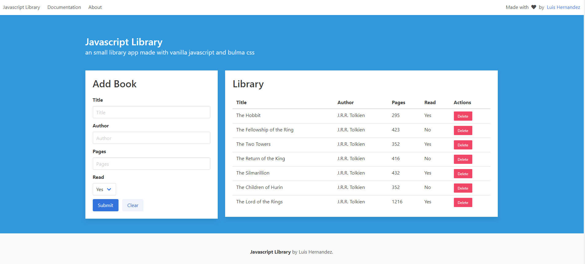
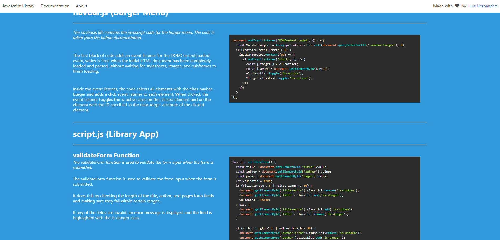
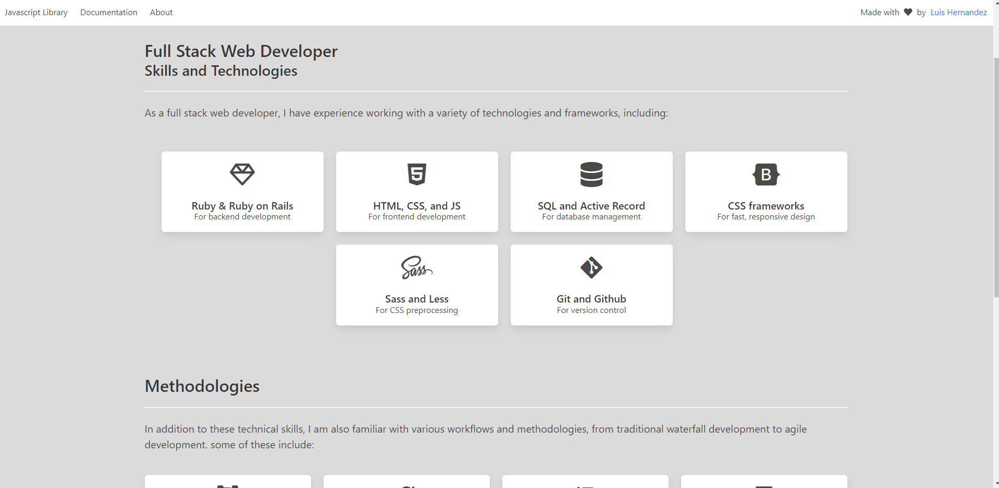

# JavaScript Library

## Short Description:
JavaScript Library is a web application that allows users to create and track books, including their title, author, number of pages, and whether or not they have been read. The app is built with vanilla JavaScript, Bulma CSS, plain HTML and is responsive.

## Previews:

## Long Description:
JavaScript Library is a simple web application that allows users to create and track books. It includes a form for creating book entries, with attributes of title, author, number of pages, and a checkbox for marking the book as read or not read. The app displays a list of all the books that have been added, along with their corresponding attributes.

The app is built with vanilla JavaScript and utilizes an object to store book information. It is styled using Bulma CSS and is responsive. The app includes a form for adding new books and buttons for deleting books and marking them as read. The book list is displayed using plain HTML. The book information is only stored for the current session and is not persisted beyond the current page refresh.

Also includes Documentation and About pages.

## Live Demo:
Deploying...

## Features:
- Create book entries with title, author, number of pages, and read/not read status
- View a list of all book entries
- Delete book entries
- Mark book entries as read
- Responsive design using Bulma CSS

## Learning Outcomes:
- Objects and object constructors
- DOM manipulation
- Event listeners
- Local storage
- Bulma CSS
- Responsive design
- Documentation
- About page

## Topics of Interest:
- JavaScript
- HTML
- Bulma CSS
- Responsive design
- Documentation
- Linters

## Made with:
- JavaScript
- HTML
- Bulma CSS
- Highligh.js (for code highlighting in documentation)
- VSCode
- Git
- Github

## Contributing:
We welcome contributions to this project! If you have an idea for a new feature or have found a bug, please open an issue or submit a pull request.

## Author:
👤 **Luis Hernandez**

- GitHub: [@LuisHernandezCoding](https://github.com/LuisHernandezCoding)
- LinkedIn: [Luis Hernandez](https://www.linkedin.com/in/luis-hernandez-coding/)

## Credits:
- [The Odin Project](https://www.theodinproject.com/)
